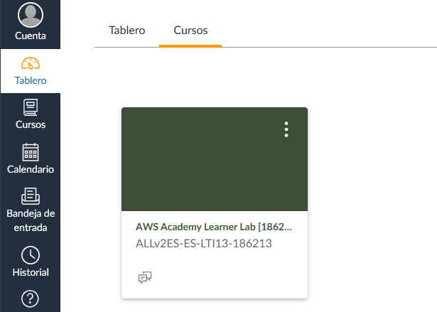
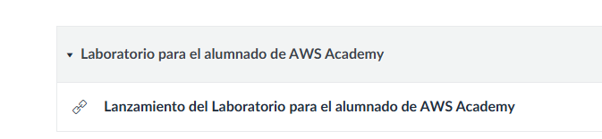
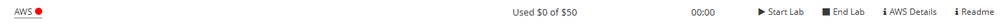
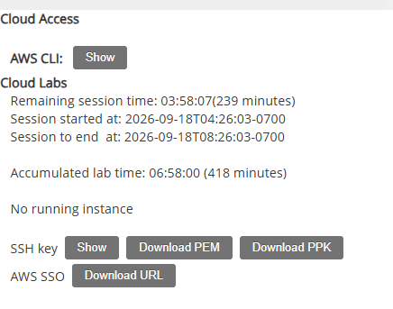
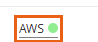
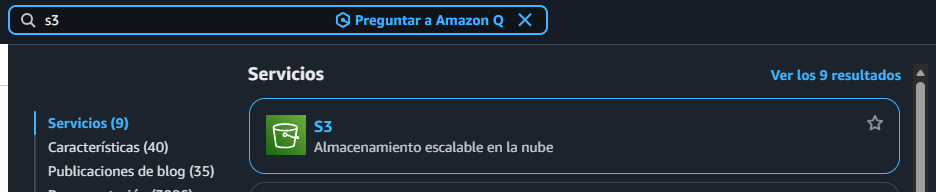
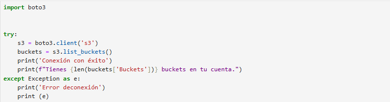

# Primera practica de cloud

1. Accede a tu curso de AWS Academy Canvas y entra en Learner Lab:
   
   primero debes entrar en google y buscar AWS e iniciar sesión, una vez dentro te diriges a panel de control y entras en tu asignatura  
   
   y te dirijes a abajo, en la  etiqueta que pone modulo, para poder acceder a tu laboratorio

    

    Lanzamiento de tu laboratorio como alumno

    

    luego le das a start lab 

    

    y cuando al luz roja se ponga en verde le das a AWS Details  y le das a Show

    

2. Interacción mediante la Consola Web (GUI)
    
    primero tienes que acceder a tu laboratorio, pienchando en WAS cuando este esté en verde

    

    Escribes s3 en el buscador superior y seleccionas s3
    y le das un nombre y luego a crear

    

    para abrir boto 3 usamos este comando desde jypiter 
    
    recomendaria usar el cli normalmente y desde python lo recomendaria usar cuando no dispongas de un cli desde el que conectarte ya que requiere levantar el servicio de jupiter desde python meintras que el otro solo es el escribir el comando directamente en el cli, aunque si teines una red que no lo permite pues es más comodo desde jupiter que levantar el laboratorio de aws.