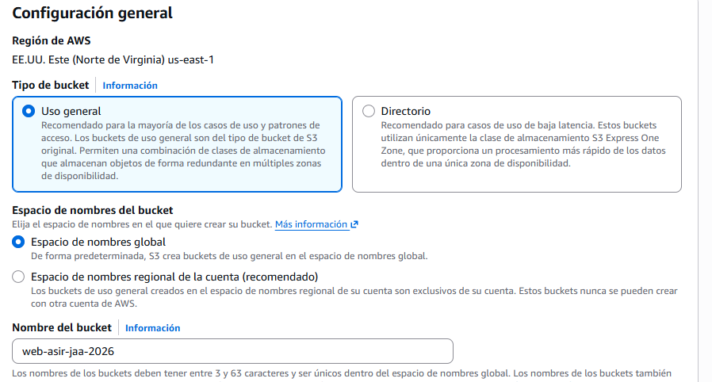
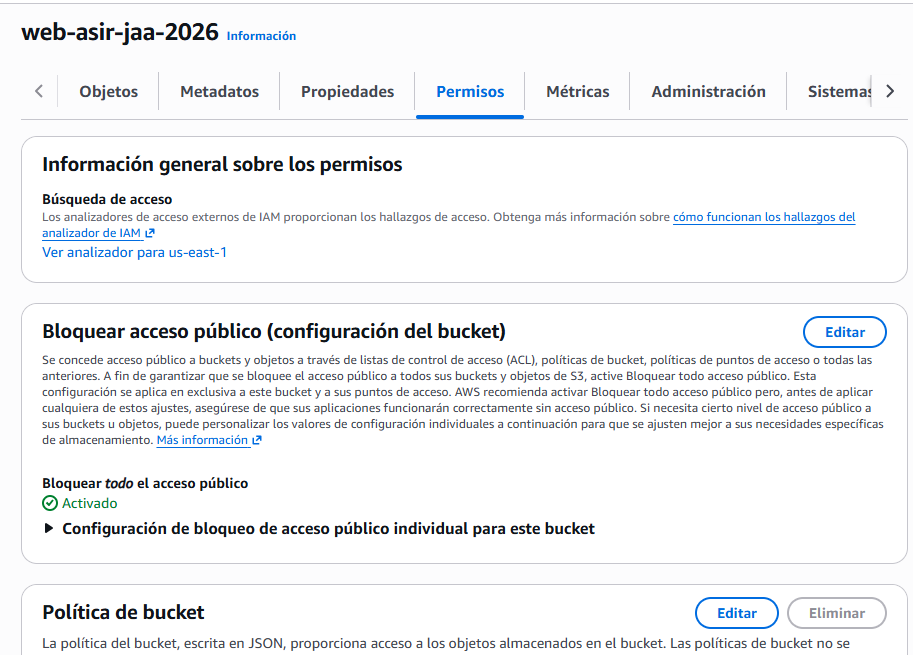

## practica 2

Primero debemos acceder a aws y crear un bucket en s3, le damos click a crear bucket 





(Antes de comprobar nada subo los archivos que ya he creado y la carpeta con los estilos dentro, dandole a subir que me aparece justo despues de crear el bucket)

Ll copiar la url me sale el texto en html porque no me añade los tokens que tengo en mi sesion pues no he iniciado sesión, esto es como medida de seguridad para que no deje entrar a nadie desde el exterior.

Luego sales del bucket que acabas de crear y vas a esta imagen 





haces click en editar y desmarcas bloquear a todo el mundo y le as a guardar cambios
Despues vas a Politica del bucket y le das a editar y pones esto en la política 


Para restringir por ip tengo que ir de nuevo  la política del bucket y editarla poniendo esto
```json
{
    "Version": "2012-10-17",
    "Statement": [
        {
            "Sid": "AllowAccessOnlyFromCampusIP",
            "Effect": "Allow",
            "Principal": "*",
            "Action": "s3:GetObject",
            "Resource": "arn:aws:s3:::web-asir-jaa-2026/*",
            "Condition": {
                "IpAddress": {
                    "aws:SourceIp": "217.71.24.8/32"
                }
            }
        }
    ]
}
```